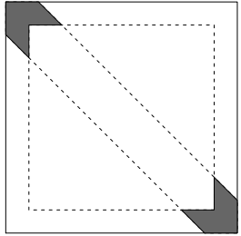

```{r setup, include=FALSE}
knitr::opts_chunk$set(echo = FALSE, eval = FALSE,
                      fig.align = "center", out.width= "30%")
```

# Références pour la simulation de loi sous `R` {-}

`R` dispose d'un ensemble de fonctions pour générer les lois usuelles (multinomiale avec `sample`, loi uniforme avec `runif`, loi normale avec `rnorm`, etc \dots).

En plus de l'aide de ces fonctions (`help(rnorm)`, par exemple), on pourra se reférer à la partie 5 du [polycopié de Christophe Chesneau](https://cel.archives-ouvertes.fr/cel-01389942/document).

# Première implémentation

On cherche à évaluer la valeur des deux intégrales suivantes:

$$I = \int_0^1\sin\left(\log(x)\right)\text{d}x,~~J = \int_{-\infty}^{+\infty}x^2\cos(x)\text{e}^{-x^2}\text{d}x$$

1. Ecrire les estimateurs de Monte Carlo, notés $\hat{J}_M$ et $\hat{J}_M$ (où $M$ est l'effort Monte Carlo) pour ces intégrales.

2. À l'aide du logiciel `R`, donnez une estimation de la valeur de ces intégrale pour un effort de Monte Carlo $M = 1000$. 

3. Quelle est la variance de $\hat{I}_1$ et $\hat{J}_1$? À l'aide des simulations obtenues précédemment, obtenez une estimation de ces variances. Servez vous de cette estimation pour calculer un intervalle de confiance asymptotique à 95% pour I.

4. Représentez graphiquement l'évolution de votre estimation en fonction de $M$ ainsi que l'intervalle de confiance associé.


# Une comparaison avec l'intégration numérique

Cet exercice est une adaptation de l'exercice 1.2 de ce [cours en ligne](https://statweb.stanford.edu/~owen/mc/Ch-intro.pdf).

On se place dans l'hypercube unitaire de dimension $d$, autrement dit, l'espace $[0, 1]^d$,
pour $d \geq 2$.

Soit $0 < \varepsilon < 1/2$, on s'intéresse à évaluer le volume d'une sous région de cette hypercube, à savoir:
$$A_{\varepsilon, d}\cap B_{\varepsilon, d}$$
où 

- $A_{\varepsilon, d}$ est l'ensemble des points du cube étant à une distance du bord plus petite que $\varepsilon$. Formellement:
$$A_{\varepsilon, d} = \left\lbrace x \in [0, 1]^d, \underset{1\leq j \leq d}{\min}\min (x_j, 1 - x_j) < \epsilon \right\rbrace$$
- $B_{\varepsilon, d}$ est l'ensemble des points du cube étant à une distance de l'hyperplan $\left\lbrace x  \in [0, 1]^d, \sum_{j = 1}^d x_j = \frac{d}{2} \right\rbrace$ plus petite que $\varepsilon$. Formellement:
$$B_{\varepsilon, d} = \left\lbrace x \in [0, 1]^d, \frac{1}{\sqrt{d}}\left\vert \sum_{j=1}^d \left(x_j - \frac{1}{2}\right) \right\vert < \epsilon \right\rbrace$$

Ci dessous, pour $d=2$, on représente en gris la surface dont on cherche le volume. L'hyperplan définit dans le texte est ici donné par la droite $x_2 = 1 - x_1$.

```{r echo = FALSE, fig.align = "center", eval = TRUE}

```


1. Justifier que le volume considéré grandit avec $d$. *On pourra justifier que le premier volume tende vers 1 quand $d\rightarrow \infty$ et que le second se stabilise vers une valeur finie*. 
*L'argument pour le premier volume est purement géométrique, l'argument pour le second peut se déduire du TCL*.

```{block2 correc_e2_q1_, type = "Correction"}

On voit immédiatement que le volume de $A_{\varepsilon, d}$ est donné par 
$$\overset{\text{Vol. cube total}}{1} - \overset{\text{Vol. cube. interieur}}{(1 - 2\varepsilon)^d},$$
ainsi, ce volume tend vers 1 quand $d$ grandit.

Concernant $B_{\varepsilon, d}$, on a que:
\begin{align*}
\text{Vol}(B_{\varepsilon, d}) &= \int_{[0,1]^d}  \mathbf{1}_{\frac{1}{\sqrt{d}}\left\vert \sum_{j=1}^d (x_j - \frac{1}{2}) \right\vert < \epsilon} \text{d} x_1\text{d} x_2 \dots \text{d} x_d&\\
&= \mathbb{P}\left( \frac{1}{\sqrt{d}}\left\vert \sum_{j=1}^d (X_j - \frac{1}{2}) \right\vert < \epsilon\right),&\text{ où } X_j \underset{j = 1,\dots, d}{\overset{i.i.d}{\sim}} \mathcal{U}[0, 1]\\
&=\mathbb{P}\left( \sqrt{d}\left\vert \frac{1}{d}\sum_{j=1}^d X_j - \frac{1}{2} \right\vert < \epsilon\right)&\\
&=\mathbb{P}\left(-\varepsilon \leq \sqrt{d}(\bar{X} - \mathbb{E}[X])\leq \varepsilon\right)&
\end{align*}
Cette dernière quantité tend vers la probabilité qu'une loi $\mathcal{N}(0, \frac{1}{12})$ soit comprise entre $-\varepsilon$ et $\varepsilon$.

```


2. Ecrire le volume recherché sous forme d'une intégrale. En déduire un estimateur Monte Carlo de ce volume.

3. Donner une estimation de ce volume pour $\varepsilon = 0.1$ et $d = 2, 5, 10, 20$. Vous choisirez vous même l'effort de Monte Carlo, en justifiant ce choix. Donnez l'incertitude associée à votre estimation.

4. À l'aide de la fonction `hcubature` du package `cubature`, donnez une valeur du volume obtenue par approximation numérique pour les mêmes valeurs de $d$.

5. Comparez les résultats et commentez.

# Evènement rare

Essayer d'estimer par méthode de Monte Carlo la probabilité $p^*$ qu'une loi $\mathcal{N}(0, 1)$ dépasse la valeur 4.

## Approche directe

1. Proposez un estimateur de Monte Carlo pour estimer cette probabilité.
2. Implémentez cet estimateur en `R` avec un effort Monte Carlo de taille $10^5$. 
Comparez les résultats avec vos voisins.
Que constatez vous? 

```{r get_mc_estimate_exo1}
get_monte_carlo_estimate <- function(M, threshold = 4){
  x_sample <- rnorm(M, 0, 1) # Simulation des X
  above_threshold <-  x_sample > threshold
  z_975 <- qnorm(0.975) # Quantile de la loi normale
  p_hat <- cumsum(above_threshold) / (1:M) # Estimation de p
  # Fast way to compute E[f(x)^2] - E[f(x)]^2 on the fly
  sigma2_p_hat <- cumsum(above_threshold^2) / (1:M) - p_hat^2
  # Sotcking in a data_frame
  tibble(index = 1:M,
         phi_x = above_threshold,
         p_hat = p_hat) %>% 
    mutate(sup_IC_emp = p_hat + z_975 * sqrt(sigma2_p_hat / index), # IC bounds
           inf_IC_emp = p_hat - z_975 * sqrt(sigma2_p_hat / index))
}
```


```{r implem_mc_gaussien, cache = T}
set.seed(123) # For reproductible results
my_monte_carlo_estimate <- get_monte_carlo_estimate(1e5)
```

```{r graphe_mc_gaussien}
my_monte_carlo_estimate %>%
  ggplot(aes(x = index, y = p_hat)) +
    geom_ribbon(mapping = aes(ymin = inf_IC_emp, ymax = sup_IC_emp), 
                fill = "lightblue", alpha = 0.5) +
  geom_point() +
  labs(x = "Effort Monte Carlo",  y = expression(hat(p)),
       title = "Estimation par Monte Carlo") +
  geom_hline(yintercept = 1 - pnorm(4), # True value
             linetype = 2, col = "red")
``` 


## Echantillonnage préférentiel

3. On se propose d'utiliser un échantillonnage préférentiel pour estimer cette probabilité.
 On utilisera comme loi d'échantillonnage une loi exponentielle translatée de 4, de paramètre $\lambda$ notée $Y\sim t\mathcal{E}(4, \lambda)$, i.e., la variable aléatoire $Y$ telle que $Y - 4 \sim \mathcal{E}(\lambda)$
 Calculer les poids d'importance associés, et proposer un estimateur de $p^*$.
 *On rappelle que si $Y \sim \mathcal{E}(\lambda)$, alors sa densité est donnée par $g(y) =  \lambda \text{e}^{-\lambda y}\mathbf{1}_{y > 0}$*
 
```{block2, type = "Correction"}
On se donne un échantillon $Y_1,\dots, Y_M$ i.i.d. de loi $t\mathcal{E}(4, \lambda)$.
On note $f$ la densité d'une loi normale $\mathcal{N}(0, 1)$ et $g$ la densité d'une loi
 $\mathcal{E}(\lambda)$. On a:
 $$g(y) = \lambda \text{e}^{-\lambda (y - 3)}\mathbf{1}_{y > 3}$$
Pour $1\leq k \leq M$, les poids d'importance sont donnés par
$$W(Y_k) = \frac{f(Y_k)}{g(Y_k)} = \frac{1}{\lambda\sqrt{2\pi}}\text{e}^{-\frac{Y_k^2}{2} + \lambda(Y_k - 3)}$$

Un estimateur de $p^*$ est donc donné par:

$$\hat{p}_M^{IS} = \frac{1}{M}\sum_{k = 1}^M \frac{f(Y_k)}{g(Y_k)} \mathbf{1}_{Y_k > 3}$$
où les $Y_1,\dots, Y_M$ sont des variables aléatoires i.i.d. selon une distribution exponentielle translatée de 3.
```

```{r get_IS_estimate}
get_IS_estimate <- function(M, lambda, threshold = 4){
  y_sample <- threshold + rexp(M, lambda) # Simulation Y
  above_threshold <-  y_sample > threshold
  z_975 <- qnorm(0.975) # Quantile de la loi normale
  weights <- dnorm(y_sample, 0, 1) / dexp(y_sample - threshold, lambda)
  p_hat <- cumsum(above_threshold * weights) / (1:M)
  sigma2_p_hat = cumsum((above_threshold * weights)^2) / (1:M) - p_hat^2
  tibble(index = 1:M,
         phi_x = above_threshold,
         p_hat = p_hat) %>% 
    mutate(sup_IC_emp = p_hat + z_975 * sqrt(sigma2_p_hat / index), # IC bounds
           inf_IC_emp = p_hat - z_975 * sqrt(sigma2_p_hat / index))
}
```

```{r my_IS_estimate}
my_IS_estimate <- get_IS_estimate(1e5, lambda = 4.5)
```

```{r compare_MC_IS}
bind_rows(mutate(my_monte_carlo_estimate,
                 Estimateur = "MC"),
          mutate(my_IS_estimate,
                 Estimateur = "IS")) %>% 
  ggplot(aes(x = index, y = p_hat)) +
    geom_ribbon(mapping = aes(ymin = inf_IC_emp, ymax = sup_IC_emp,
                              fill = Estimateur), 
                alpha = 0.5) +
  geom_line(aes(color = Estimateur)) +
  labs(x = "Effort Monte Carlo",  y = expression(hat(p)),
       title = "Estimation") +
  facet_wrap(.~Estimateur, scales = "free_y") +
  geom_hline(yintercept = 1 - pnorm(4), # True value
             linetype = 2, col = "red") +
  theme(legend.position = "none")
```

 
4. Implémenter cet estimateur sur `R` avec $\lambda = 4.5$ et le comparer à celui de Monte Carlo.

# Simulation de variable aléatoire